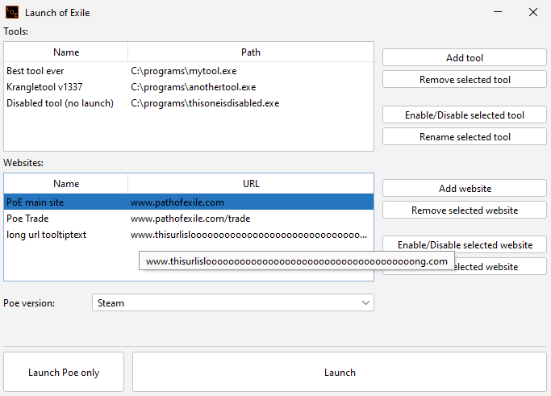

# Launch of Exile

### Overview

Launch of exile is a launcher for Path of Exile.

- Start tools, open websites and launch PoE with a single click
- Activation/Deactivation feature 
- Custom names
- Supports Steam and standalone version
- Option to launch PoE without tools/websites
- Option to skip the launcher
- Optional dark mode

### How to Install

The launcher is written in java, but you don't need to have java installed.
Everything needed comes pre-packaged as an installer.

Simply download the installer from the latest release, install it, done.

### How to Use

It's pretty self Explanatory.
1. Choose your PoE version.
2. Add the tools and website you want to use.
3. launch.

### FAQ

- Help! My tool won't start!
  
  That might be because it needs admin rights try to set the launcher to start in admin mode (right click -> properties -> compatibility -> change settings for all users -> start as admin).
  
- Can I skip the launcher entirely?

  Yes! Just create a shortcut and add -skiplauncher to the target (right click -> properties).

- The File extension of my tool is not supported.

  In that case please tell me about it, I will try to find a solution.
---
This product isn't affiliated with or endorsed by Grinding Gear Games in any way.
